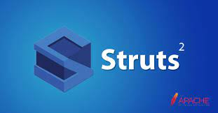
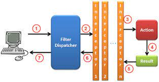

# Struts2

Struts 2 es un framework para el desarrollo de aplicaciones web, el cual hace que la implementación de las mismas sea más sencillo, más rápido, y con menos complicaciones. Además hace que estas sean más robustas y flexibles. El objetivo de Struts 2 es muy sencillo: hacer que el desarrollo de aplicaciones web sea simple para los desarrolladores.

## Componentes de Struts 2

El corazón de Struts 2 es un filtro, conocido como el "FilterDispatcher". Este es el punto de entrada del framework. A partir de él se lanza la ejecución de todas las peticiones que involucran al framework.

Las principales responsabilidades del "FilterDispatcher" son:

- Ejecutar los Actions, que son los manejadores de las peticiones.
- Comenzar la ejecución de la cadena de interceptores (de la que hablaremos en un momento).
- Limpiar el "ActionContext", para evitar fugas de memoria.

Struts 2 procesa las peticiones usando tres elementos principales:

- Acciones: Las acciones o Actions son clases encargadas de realizar la lógica para servir una petición. Cada URL es mapeada a una acción específica, la cual proporciona la lógica necesaria para servir a cada petición hecha por el usuario.
- Resultados: Después que un Action ha sido procesado se debe enviar la respuesta de regreso al usuario, esto se realiza usando results.
- Interceptores: Los interceptores son clases que siguen el patrón interceptor. Estos permiten que se implementen funcionalidades cruzadas o comunes para todos los Actions, pero que se ejecuten fuera del Action (por ejemplo validaciones de datos, conversiones de tipos, población de datos, etc.).

## Funcionamiento de Struts 2

Veamos de forma general cómo son procesadas las peticiones por una aplicación desarrollada en Struts 2. La siguiente imagen nos ayudará con esto:

1. El navegador web hace una petición para un recurso de la aplicación (index.action, reporte.pdf, etc.). El filtro de Struts revisa la petición y determina el Action apropiado para servirla.
2. Se aplican los interceptores, los cuales realizan algunas funciones como validaciones, flujos de trabajo, manejo de la subida de archivos, etc.
3. Se ejecuta el método adecuado del Action (por default el método "execute"), este método usualmente almacena y/o regresa alguna información referente al proceso.
4. El Action indica cuál result debe ser aplicado. El result genera la salida apropiada dependiendo del resultado del proceso.
5. Se aplican al resultado los mismos interceptores que se aplicaron a la petición, pero en orden inverso.
6. El resultado vuelve a pasar por el FilterDispatcher aunque este ya no hace ningún proceso sobre el resultado (por definición de la especificación de Servlets y Filters, si una petición pasa por un filtro, su respuesta asociada pasa también por el mismo filtro).
7. El resultado es enviado al usuario y este lo visualiza.

## Creacion de un proyecto de Struts2

Primero de todo sería configurar un servidor tomcat en nuestro eclipse donde podamos desplegar nuestras aplicaciones, ya que Struts2 son proyectos web.

Para crear un proyecto Struts2 es mejor usar las depencenicas con maven. Para ello seguimos los siguientes pasos:

1. Crear un proyecto Maven, boton derecho | new proyect | maven proyect
2. Elegimos el arquetipo con id <b>maven-archetype-webapp</b> del grupo <b>org.apache.maven-archetype</b>
3. Damos un Artifact id y un group ID

Una vez creado el proyecto debemos de actualizar la versión java a la queramos dentro del fichero
pom.xml

	<properties>
		<project.build.sourceEncoding>UTF-8</project.build.sourceEncoding>
		<maven.compiler.source>11</maven.compiler.source>
		<maven.compiler.target>11</maven.compiler.target>
	</properties>

Lo siguiente es escoger un descripor de despliegue más actual, para ello hay que actualizar las proyect facets.

1. Boton derecho sobre el proyecto y elegir properties
2. Ir al apartado Proyect facets
3. Elegir la versión 3.1
4. Borrar el fichero web.xml y generar uno nuevo con el nuevo descriptor de despliegue, para ello boton derecho sobre el proyecto | JavaEE tools | Generate Deployment Descriptor

Una vez montado nuestro proyecto web maven vamos a introducir las librerías necesarias. Cambiamos el pom con dependencias de los servlets y las librerías struts

	<!-- for web servlet -->
	<dependency>
	    <groupId>javax.servlet</groupId>
	    <artifactId>javax.servlet-api</artifactId>
	    <version>3.1.0</version>
	    <scope>provided</scope>
	</dependency>
	
    <!-- Some containers like Tomcat don't have jstl library -->
    <dependency>
        <groupId>javax.servlet</groupId>
        <artifactId>jstl</artifactId>
        <version>1.2</version>
        <scope>provided</scope>
    </dependency>
        
	<dependency>
		<groupId>org.apache.struts</groupId>
		<artifactId>struts2-core</artifactId>
		<version>2.3.37</version>
	</dependency>
	
Una vez metidas las dependencias, debemos actualizar el proyecto

1. Boton derecho sobre el proyecto
2. Maven
3. Update maven proyect.

Podemos encontrar los siguientes problemas al realizar todos los pasos anteriores:
1. No aparecen los ficheros main/java ni test/java, eclipse a veces no se da cuenta de los cambios de carpetas, podemos entrar en java build path para verlo y si estan ahi, simplemente pulsamos
"apply"
2. El web.xml nuevo da error. Esto se puede solucionar borrando las paginas de bienvenida que no vamos a usar.

El siguiente paso será crear una instancia de servidor, meter dentro el proyecto y arrancarlo para ver que funciona todo.

Ahora tenemos que crear el listener que hara de face controller en nuestra aplicación de struts2, para ello debemos de configurar lo siguiente en nuestro web.xml

	<filter>
	  <filter-name>struts2</filter-name>
	  <filter-class>org.apache.struts2.dispatcher.ng.filter.StrutsPrepareAndExecuteFilter</filter-class>
	</filter>
	 
	<filter-mapping>
	  <filter-name>struts2</filter-name>
	   <url-pattern>/*</url-pattern>
	</filter-mapping>
	
El ultimo paso sería crear el fichero struts.xml dentro de la carpeta src/main/resources con una configuración minima, podemos usar un fichero ya creado. Es posible que haya que crear la caperta src/main/resources y añadirla al classpath si maven no nos la ha creado. Para ello:

1. Creamos la carpeta en src/main y la llamamos "resources"
2. Boton derecho sobre el proyecto | Build Path | Configure Build Path
3. En la pestaña "Source" pulsamos el boton "Add Folder" y elegimos la carpeta "resources" que acabamos de crear.
4. Aplicamos y cerramos

Ya podemos crear el fichero struts.xml dentro de la carpeta. Podemos usar como base el fichero struts.xml de este ejemplo.

Arrancamos de nuevo y ponemos una de las siguientes direcciones:
- http://localhost:8080/01_Introduccion/index.action
- http://localhost:8080/01_Introduccion/index

Podemos configurar un sistema de log como log4j. En este caso tenemos que crear el fichero log4j.xml en src/main/resources y meter las dependecias en el pom.xml

## Bibliografia
https://mkyong.com/maven/how-to-create-a-web-application-project-with-maven/
https://www.javainterviewpoint.com/how-to-fix-cannot-change-version-of-project-facet-dynamic-web-module-to-2-5-error-in-eclipse/
https://www.topjavatutorial.com/frameworks/maven/missing-srcmainresources-in-maven-project/
https://cwiki.apache.org/confluence/display/WW/Create+Struts+2+Web+Application+Using+Maven+To+Manage+Artifacts+and+To+Build+The+Application